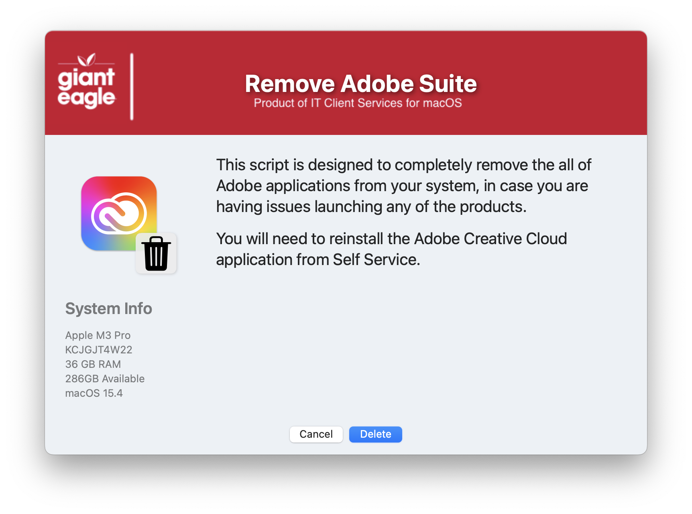

## Nuke Adobe CC

Sometimes applications in the Adobe CC suite just refuse to work properly and the "offical" Adobe uninstaller just doesn't seem to fix the issue, so here is a script to do a "seek & destroy" of anything Adobe related on the user's Mac.

#### 1.0 - Initial
#### 1.1 - Major code cleanup & documentation / Structured code to be more inline / consistent across all apps
#### 1.2 - Remove the MAC_HADWARE_CLASS item as it was misspelled and not used anymore...
#### 1.3 - Code cleanup
####       Added feature to read in defaults file
####       removed unnecessary variables.
####       Bumped min version of SD to 2.5.0
####       Fixed typos