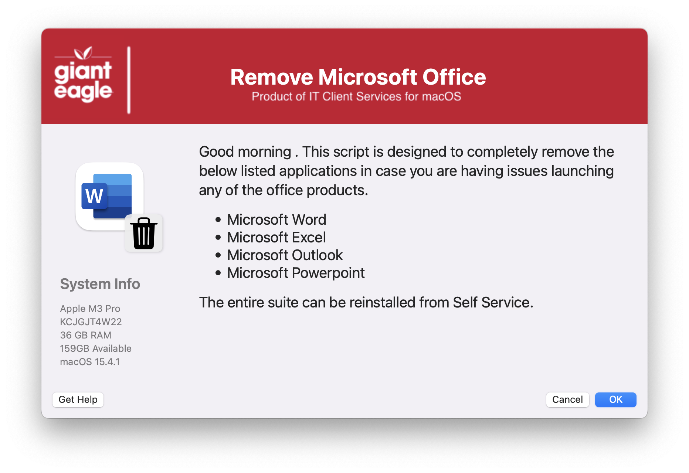

## Nuke Adobe CC

Sometimes applications in the Microsoft Office suite just refuse to work properly and the "official" Office uninstaller just doesn't seem to fix the issue, so here is a script to do a "seek & destroy" of Microsoft Office related files on the user's Mac  (this will not remove Teams or OneNote).

#### 1.0 - Initial
#### 1.1 - Code optimization
#### 1.2 - Remove the MAC_HADWARE_CLASS item as it was misspelled and not used anymore...
#### 1.3 - Code cleanup
####       Added feature to read in defaults file
####       removed unnecessary variables.
####       Bumped min version of SD to 2.5.0
####       Fixed typos
#### 1.4	Add removal for Teams
