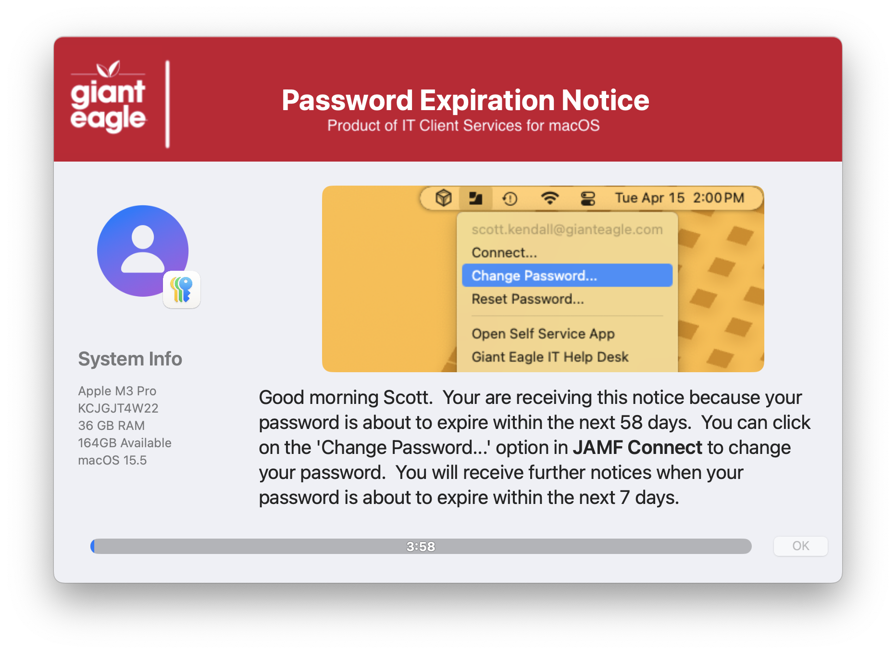
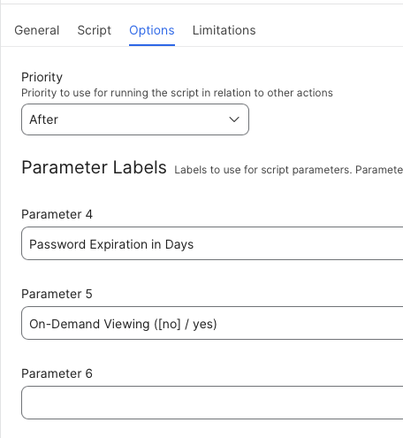

## Password Expiration Notice

I was wanting to find a way to notify the users if their network password is about to expire.  I key off a configuration.plist file that has the key 'PasswordLastChanged' and determine how many days are left until their password expires.  

The variable PASSWORD_EXPIRE_IN_DAYS can be used to set your expiration length (in days).  The script will show a notification center dialog if you the user is within 7 days of expiration.

v1.2 adds the option to view your password days until expiration "on demand" so you can view it directly from Self service.

**Initial Prompt**

**Notification Center prompt**

**Script Parameters**

#### 1.0 - Initial Release
#### 1.1 - Major code cleanup & documentation
####		 Structured code to be more inline / consistent across all apps
#### 1.2 - Remove the MAC_HADWARE_CLASS item as it was misspelled and not used anymore...
#### 1.3 - Fixed password age calculation
#### 		 Add support for 'on demand' viewing of password
#### 1.4 - Changed variable declarations around for better readability
#### 1.5 - Code cleanup
####       Added feature to read in defaults file
####       removed unnecessary variables.
####       SD min version is now 2.5.0
####       Fixed typos
