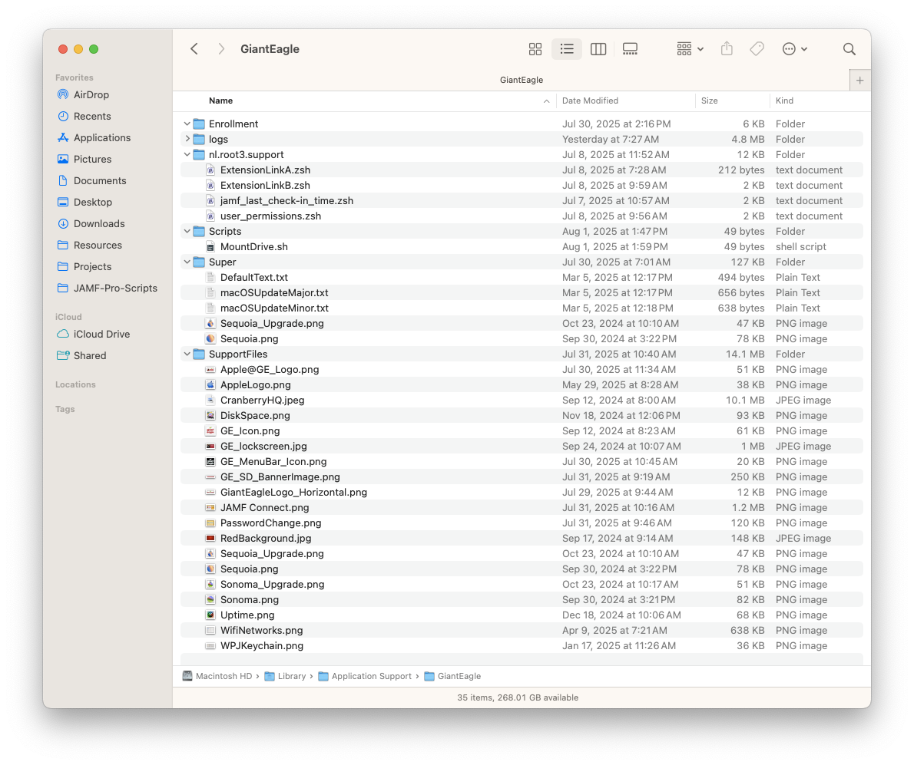
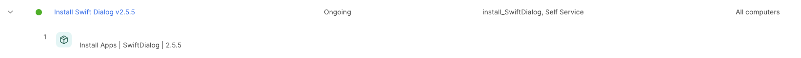
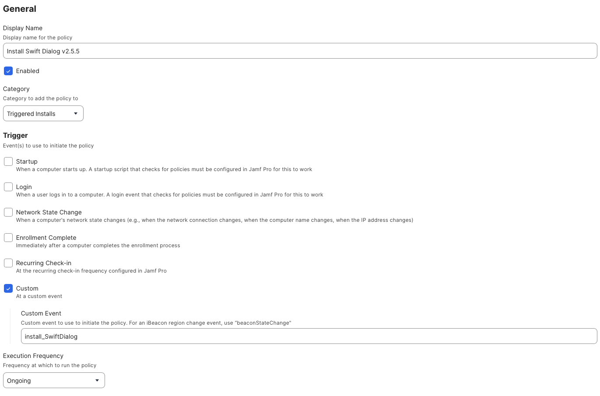
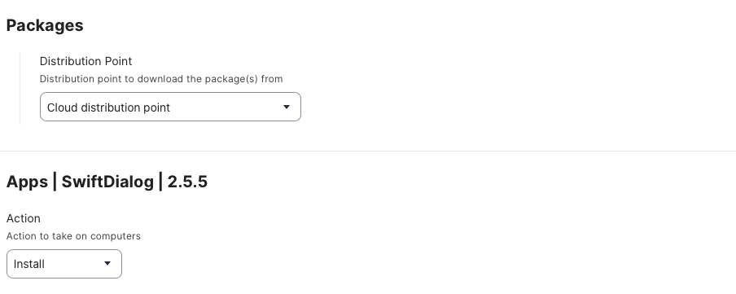

# JAMF-Pro-Scripts
Scripts that I have developed over the years working with JAMF Pro

The information below is a summary of how my support folders are constructed and what the variables are:

### Application Variables ###
```
export PATH=/usr/bin:/bin:/usr/sbin:/sbin
SCRIPT_NAME="MainLibrary"
ICON_FILES="/System/Library/CoreServices/CoreTypes.bundle/Contents/Resources/"

# Swift Dialog version requirements

SW_DIALOG="/usr/local/bin/dialog"
MIN_SD_REQUIRED_VERSION="2.5.0"
[[ -e "${SW_DIALOG}" ]] && SD_VERSION=$( ${SW_DIALOG} --version) || SD_VERSION="0.0.0"

# Make some temp files for this app

JSON_OPTIONS=$(mktemp /var/tmp/$SCRIPT_NAME.XXXXX)
TMP_FILE_STORAGE=$(mktemp /var/tmp/$SCRIPT_NAME.XXXXX)
/bin/chmod 666 $JSON_OPTIONS
/bin/chmod 666 $TMP_FILE_STORAGE

SD_DIALOG_GREETING=$((){print Good ${argv[2+($1>11)+($1>18)]}} ${(%):-%D{%H}} morning afternoon evening)

###################################################
#
# App Specific variables (Feel free to change these)
#
###################################################

# See if there is a "defaults" file...if so, read in the contents
DEFAULTS_DIR="/Library/Managed Preferences/com.gianteaglescript.defaults.plist"
if [[ -e $DEFAULTS_DIR ]]; then
    echo "Found Defaults Files.  Reading in Info"
    SUPPORT_DIR=$(defaults read $DEFAULTS_DIR "SupportFiles")
    SD_BANNER_IMAGE=$SUPPORT_DIR$(defaults read $DEFAULTS_DIR "BannerImage")
    spacing=$(defaults read $DEFAULTS_DIR "BannerPadding")
    repeat $spacing BANNER_TEXT_PADDING+=" "
else
    SUPPORT_DIR="/Library/Application Support/GiantEagle"
    SD_BANNER_IMAGE="${SUPPORT_DIR}/SupportFiles/GE_SD_BannerImage.png"
    BANNER_TEXT_PADDING="      " #5 spaces to accommodate for icon offset
fi

# Log files location

LOG_FILE="${SUPPORT_DIR}/logs/${SCRIPT_NAME}.log"

# Display items (banner / icon)

SD_WINDOW_TITLE="${BANNER_TEXT_PADDING}Delete Applications"
OVERLAY_ICON="/System/Applications/App Store.app"
SD_ICON_FILE=$ICON_FILES"ToolbarCustomizeIcon.icns"

# Trigger installs for Images & icons

SUPPORT_FILE_INSTALL_POLICY="install_SymFiles"
DIALOG_INSTALL_POLICY="install_SwiftDialog"
```

### SUPPORT_DIR Directory ###
The ```SUPPORT_DIR``` is the starting directory of where you want to store all of your logs, images, screenshots, etc.  Currently this is how I format my structure (mine starts at /Library/Application Support/GiantEagle)



### Defaults Configuration File ###

**This defaults file is created via JAMF Configuration Profiles and scoped to all users.**

Some application defaults are stored in `/Library/Managed Preferences/com.gianteaglescript.defaults.plist` which consists of

```
<?xml version="1.0" encoding="UTF-8"?>
<!DOCTYPE plist PUBLIC "-//Apple//DTD PLIST 1.0//EN" "http://www.apple.com/DTDs/PropertyList-1.0.dtd">
<plist version="1.0">
  <dict>
    <key>SupportFiles</key>
    <string>/Library/Application Support/GiantEagle</string>
    <key>BannerImage</key>
    <string>/SupportFiles/GE_SD_BannerImage.png</string>
    <key>BannerPadding</key>
    <string>5</string>
  </dict>
</plist>
```
If that file exists, the data is read in, otherwise they have to be declared inside of each app.

`LOG_FILES`: Location & Name of the file you want to store your log files.  As you can see in my above examples, both the Temp files and `LOG_FILES` are a combination of the `SUPPORT_DIR` and `SCRIPT_NAME`, so this is always set, but you can change this if you need to.

`BANNER_TEXT_PADDING`: I create window banners with a logo in the left corner, so I need to offset the text so it looks centered.  _NOTE: If you have the defaults file, store the number of spaces in the key and it will create the padding when it is read in._

`SD_WINDOW_TITLE`: Title of the window that you are displaying

`SD_BANNER_IMAGE`: Location & name of the banner that you want to display _(Will also be set by the defaults file if found)_

`SD_ICON_FILE` & `OVERLAY_ICON`: The Location of a PNG, JPG or ICNS or Web URL file that you want to display as the main & overlay icon respectively.  I wrote a nifty app to help in creating both Icons and Overlay Icons [here](https://github.com/ScottEKendall/JAMF-Pro-Scripts/tree/main/DialogIconCreator)

### Trigger Installs ###

All of my scripts will check for specific items (Swift Dialog, Banner Images, jq, etc).  If those items are not present before the script runs, it will call the trigger policy.  The is a custom name that you give a JAMF policy that will install a piece of software for you.  For example, this is what I have if SwiftDialog is not installed already:

(NOTE: Some of the scripts using a binary executable called "jq".  This is installed with macOS Sequoia and higher, but you have to manually install it for OSes prior to macOS Sequoia)

The policy listing for Swift Dialog: (Make sure to scope it to all users)



The details of the policy itself.  Notice the trigger name in the "Custom" seciton



And what gets installed during the policy execution.  




### Passed in Variables ###
```
##################################################
#
# Passed in variables
# 
#################################################

JAMF_LOGGED_IN_USER=${3:-"$LOGGED_IN_USER"}    # Passed in by JAMF automatically
SD_FIRST_NAME="${(C)JAMF_LOGGED_IN_USER%%.*}"   

SD_WELCOME_MSG="${5:-"Information Message"}"
SD_WELCOME_MSG_ALT="${6:-""}"
SD_BUTTON1_PROMPT="${7:-"OK"}"
SD_IMAGE_TO_DISPLAY="${8:-""}"
SD_IMAGE_POLICY="${9:-""}"
SD_ICON_PRIMARY="${10:-"AlertNoteIcon.icns"}"
SD_TIMER="${11-120}"
```

Some of my scripts will used passed in variables from the script parameter page, you can also set defaults on variables if they are not passed in (this is referred to as ZSH Parameter Expansion)

The above example is taken from the DialogMsg script:

```JAMF_LOGGED_IN_USER```: JAMF automatically passes in some items for you. Param #3 is user name

```SD_WELCOME_MSG```: Will default to "Information Message", it nothing is passed in

```SD_ICON_PRIMARY```: will use the AlertNote icon if nothing is passed in

```SD_TIMER```: will default to 120 seconds if nothing is passed in
