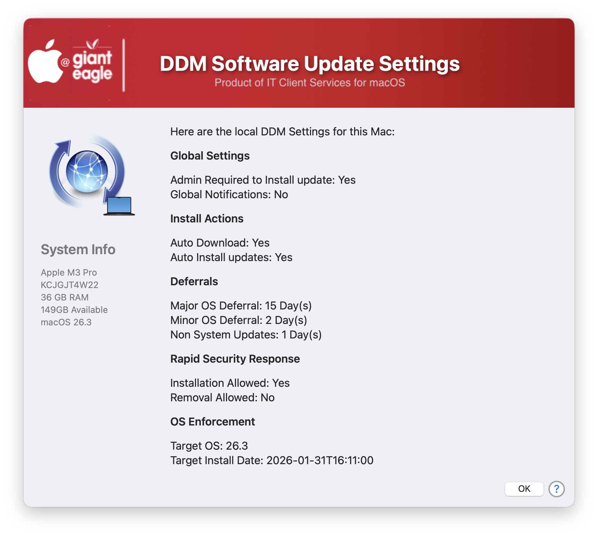

## Read DDM Software update

Small utility designed to read in the local DDM software settings that are assigned to the computer.  This same info can be retrieved from System Settings > General > Device Management > MDM Profile, but I wanted something that could easily be run from Self Service.

| **Version**|**Notes**|
|:--------:|-----|
| 1.0 | Initial
