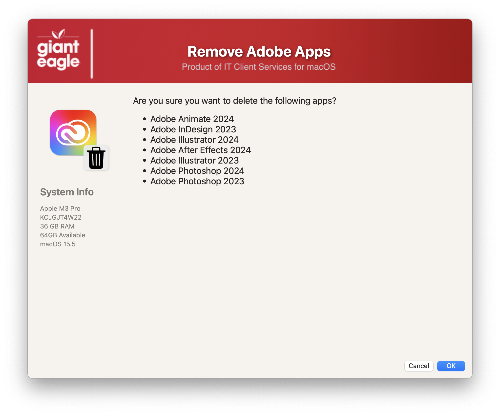

## Remove Adobe Apps

This process can be run one of two ways:  

## Prompt Method
The prompt method will display a dialog that will allow the users to choose which Adobe apps that they want to remove. 

## Silent Method
This method will remove all of the Adobe CC and/or 3D apps that it finds without any user interaction.

### Note: ###
Both methods will NOT let the highest "level" product version installed. (see the selection screenshots).  This process wil also remove any CS apps as well as Safari Flash plugin, outdated Reader and Acrobat apps as well.

**Selection Screen**

(An optional JAMF variable can be passed in to show the current CC year.)  If the user does not have that version already installed, it will display the notice that a newer version is available).  


**Confirmation Screen**



**Removal Process**


I have tested this against several years worth of apps, but I have not tested anything prior to 2021


Results of the```AdobeCCUninstaller --list``` command to show the BASE Codes and SAPCodes


The two critial functions for this process are noted here:

```extract_version_code()```: (This handles any "descrepencies" from Adobe's BaseVersion naming convention).  I use the ```CFBundleShortVersionString``` plist entry to determine the Baseversion number, but Adobe is not 100% consistent with their numbering scheme, so editng the CASE statement in this function can allow for changes to the version string.

```adobeJSONarray```:  This handles the Application name and its SAPCode.

Feel free to change those two areas to accomodate anything that I might have missed during testing!

## Script Parameters ##

The optional JAMF script parameter values can be set to show
* The latest available version of CC
* Silent/Prompt mode
* Alow the removal of both CC & 3D apps or just the CC apps


## Adobe Uninstallers ##

NOTE! The terminal binaries "AdobeUninstaller" and the files inside the folder Adobe_CC_and_below, must be installed in /usr/local/bin for this to work properly.

I packaged up both of these apps and the script will request the JAMF install if they are missing.

#### 1.0 - Initial
#### 1.1 - Changed buttons to "Next" and "Remove" on the appropriate screens
#### 1.2 - Change find command to exclude Adobe Experience Manager and Adobe Acrobat DC
#### 1.3 - Add option for "silent" remove (no prompt) and which apps than can be removed 3D & CC or CC only
#### 1.4 - Move some functions calls to the top to make sure they get execute for both types of removal
#### 1.5 - Remove the MAC_HADWARE_CLASS item as it was misspelled and not used anymore...
#### 1.6 - Modified section headers for better organization
#### 1.7 - Fix line #468 to force check lowercase parameter
#### 1.8 - Added option to allow deletion of current year / fixed Bridge 2025 version #
#### 1.9 - Code cleanup
####       Added feature to read in defaults file
####       removed unnecessary variables.
####       Fixed typos

