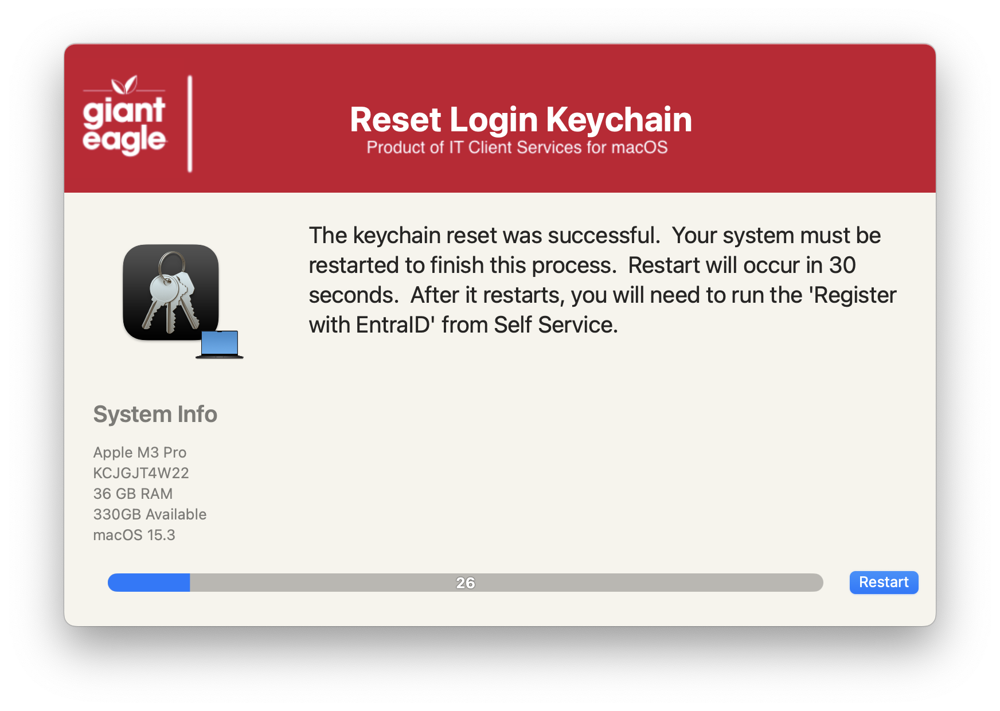

## Reset Keychain
There comes a time when a user might need to reset a keychain due to various reasons.  This is a GUI frontend to allow the users to do that themselves.  It creates a backup of the entire Keychain folder before deleting the items.  The users will have to restart after this is done.

#### 1.0 - Initial
#### 1.1 - Code cleanup to be more consistent with all apps
#### 1.2 - Remove the MAC_HADWARE_CLASS item as it was misspelled and not used anymore...
#### 1.3 - Code cleanup
####       Added feature to read in defaults file
####       Change the restart command to use AppleScript...much safer than the shutdown command
####       removed unnecessary variables.
####       Bumped min version of SD to 2.5.0
####       Fixed typos
