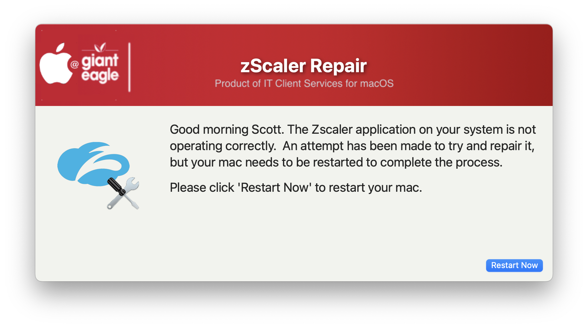

## Restart zScaler

This script is designed to test the functionality of zScaler.  If it detects that it is not running properly, it will attempt to do a repair on the LaunchDaemon and then prompt the user to restart their Computer

#### 1.0 - Initial
#### 1.1 - Remove the MAC_HADWARE_CLASS item as it was misspelled and not used anymore...
#### 1.2 - Code cleanup
####       Added feature to read in defaults file
####       Change the restart command to use AppleScript...much safer than the shutdown command
####       removed unnecessary variables.
####       Bumped min version of SD to 2.5.0
####       Fixed typos
