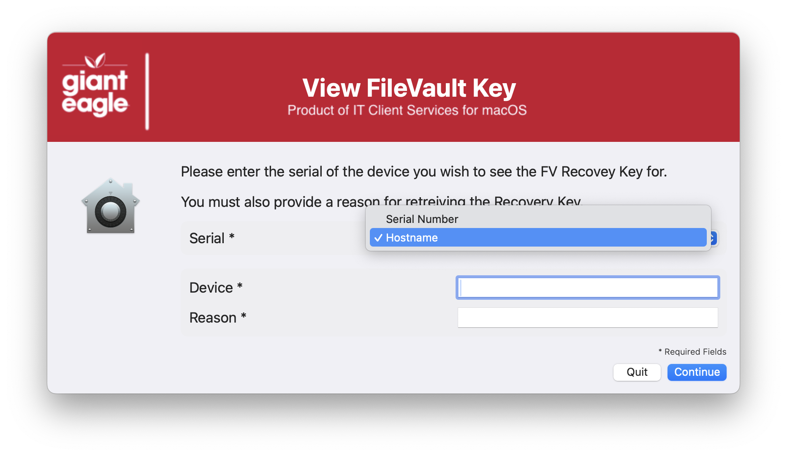
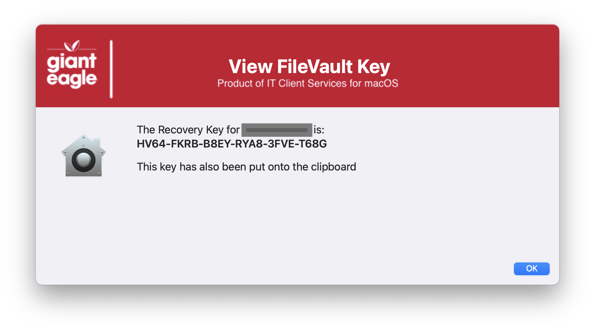

## Retrieve FileVault Password

Trying to create a series of scripts to assist the HelpDesk in doing some macOS Support.  I don't want to give them access the JAMF as it would be way to confusing for them.  They can find the system by either Serial # or by HostName, and they have to give a reason for the pull.





## JAMF API Information ##

If you are using the Modern JAMF API credentials, you need to set:

```Read Computer Security```

```Read Computers```

##### _v1.0 - Initial Commit_
##### _v1.1 - Major code cleanup & documentation / Structred code to be more inline / consistent across all apps_
##### _2.0 - You can now use JAMF classic & modern credentials_
#####   Added feature to read in defaults file
#####   Add verification of JAMF credentials and error trapping if ID doesn't have rights
#####   Compatible with JAMF 11.21 and higher using the new APIs
