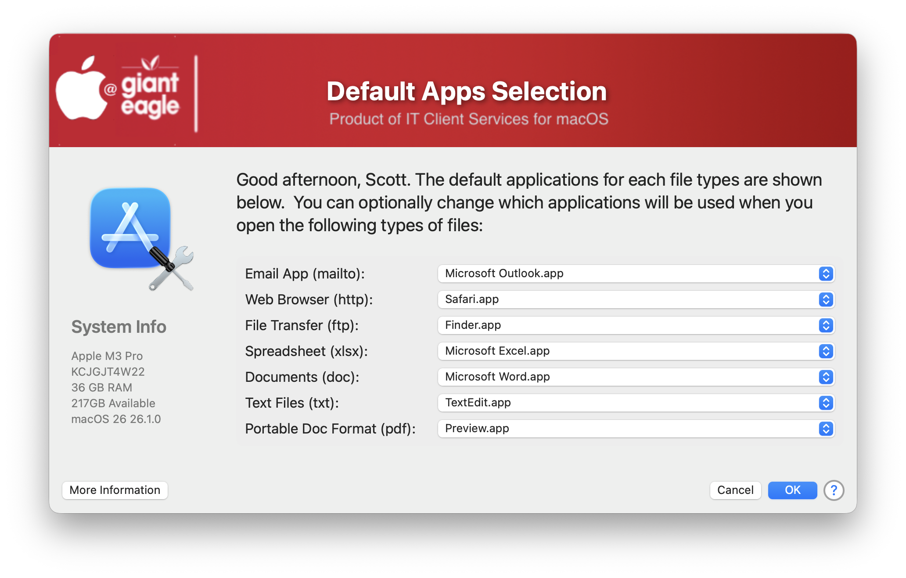
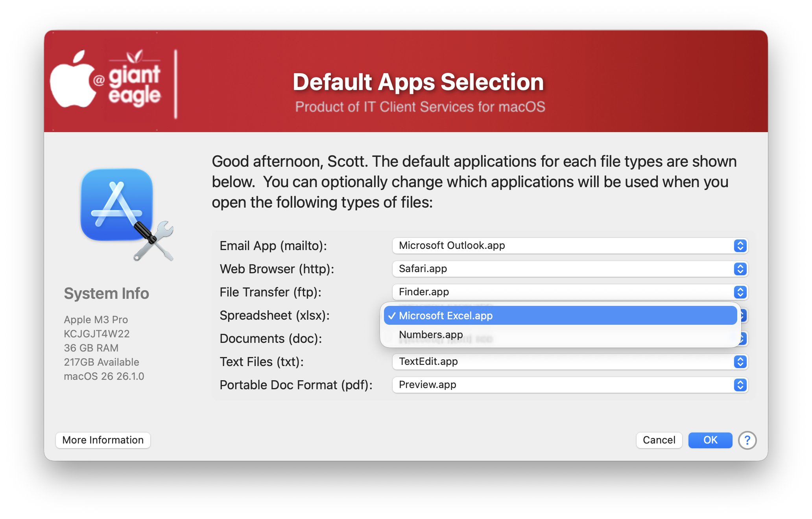

## Set Default Apps

Apple doesn't make it easy to change your default apps for some file types.  There used to be several methods that worked via the System Preferences, but those projects are no longer developed nor do they work in modern OSes such as macOS Ventura and higher. Armin Briegel wrote a nifty CLI app called "utiluti" that allows you to change just about any default app / file type on your system.  This script is based on his work, I just put a GUI front end to it for simple app changing.



The script will show you what is currently set as your default app and will only show you the apps that are capable of opening those particular file types



You can customize the script very easily and add your own extensions list to the display:

Call the "get_uti" function to retrieve what applications are available for a particular file type
```
utiMailTo=$(get_uti_results "mailto")
utiHttp=$(get_uti_results "https")
utiFtp=$(get_uti_results "ftp")
utiXLS=$(get_uti_results "xlsx")
utiDoc=$(get_uti_results "docx")
utiTxt=$(get_uti_results "txt")
utiPDF=$(get_uti_results "pdf")
```

and then call the "set_uti" function to set the default app

```
set_uti_results $resultsMailTo "mailto"
set_uti_results $resultsHttp "http"
set_uti_results $resultsFtp "ftp"
set_uti_results $resultsXls "xlsx"
set_uti_results $resultsDoc "docx"
set_uti_results $resultsTxt "txt"
set_uti_results $resultsPDF "pdf"
```

I have only tapped a very very small portion of what this CLI can do, I just wanted to get something out for my users so they can change their default apps easily.

Link to utiluti: https://github.com/scriptingosx/utiluti

macvfx has modified this script to be MDM agnostic, if you want to use that version it can be found at https://github.com/macvfx/SetDefaultAppsX

#### 1.0 - Initial 

