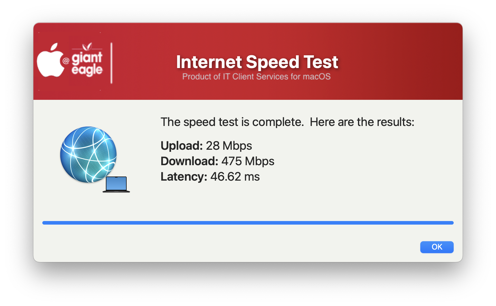

## Speed Test

This one grew out of necessity.  Instead of having people go to an external site to do a speedtest, I create this simple script to do it for them. 

| **Version**|**Notes**|
|:--------:|-----|
| 1.0 | Initial
| 1.1 | Remove the MAC_HADWARE_CLASS item as it was misspelled and not used anymore...
| 1.2 | Code cleanup
||       Added feature to read in defaults file
||       removed unnecessary variables.
||       Bumped min version of SD to 2.5.0
||       Fixed typos
| 1.3 | Had to increase window height for Tahoe & SD v3.0
| 1.4 | Changed JAMF 'policy -trigger' to 'JAMF policy -event'
||       Optimized "Common" section for better performance
||       Fixed variable names in the defaults file section
