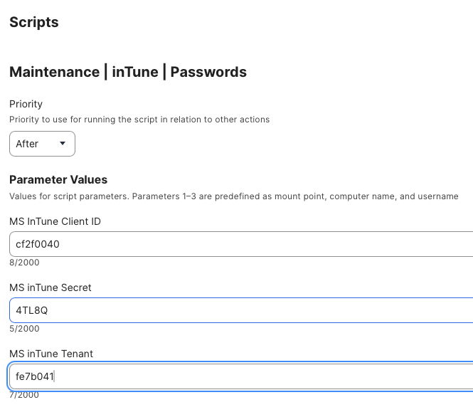
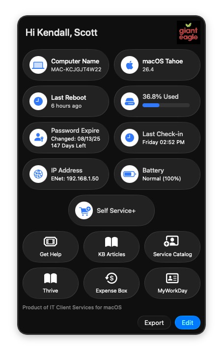

## Support.app Setup

In our environment we use Entra / JAMF and no Kerberos.  What I was trying to accomplish for the end users is to give them some kind of idea of when their paswswords are about ready to expire.  There are couple of ways that you can do this:

1.  You can use the local login password reset date, but that might not have the same time sync as the Entra server
    ````
    passwordAge=$(expr $(expr $(date +%s) - $(dscl . read /Users/${LOGGED_IN_USER} | grep -A1 passwordLastSetTime | grep real | awk -F'real>|</real' '{print $2}' | awk -F'.' '{print $1}')) / 86400)
2.  Or you can get the information from the Entra server using the MS Graph API.  I have the script for that [here](https://github.com/ScottEKendall/JAMF-Pro-System-Scripts/blob/main/Maintenance%20-%20InTune%20-%20Passwords.sh)

## Password retrieval

    Disclaimer: This may not be the best method to retrieve / store network passwords, but this has been working flawlessly for me for the past year.  I welcome any recommendations on a better idea.

1.  Use this script from my repo [found here](https://github.com/ScottEKendall/JAMF-Pro-System-Scripts/blob/main/Maintenance%20-%20InTune%20-%20Passwords.sh) and have it run Once a Day.  You will need to provide your Entra credentials for the script.



2.  When that runs, it will update and/or create the .plist file and store it in the User's personal library  `~/Library/Application Support/<filename.plist>`. I do this location as I have multi-user macs in my environment.

Here is the structure of that file

```
<?xml version="1.0" encoding="UTF-8"?>
<!DOCTYPE plist PUBLIC "-//Apple//DTD PLIST 1.0//EN" "http://www.apple.com/DTDs/PropertyList-1.0.dtd">
<plist version="1.0">
<dict>
	<key>DriveMappings</key>
	<array>
		<string>smb://dfs11inf2/clientserver</string>
		<string>smb://dfs10INF1/common</string>
	</array>
	<key>EntraAdminRights</key>
	<string>Yes</string>
	<key>EntraGroups</key>
	<array>
		<string>CLIENT TECHNOLOGIES</string>
	</array>
	<key>PasswordAge</key>
	<string>218</string>
	<key>PasswordLastChanged</key>
	<string>2025-08-13T18:16:13Z</string>
</dict>
</plist>
```

The key fields that we are going to use are `<PasswordAge>` and `<PasswordLastChanged>`.

    NOTE: I create the local file so I don't have to constantly log into the server to get password info.  Saves time and I believe it offers more flexibility for local scripting on the machine

3.  If you want to retreieve the PasswordAge field (or any field) use the `defaults read` to retrieve the data:

```
plistFile="<file location>
PasswordAge=$(defaults read "$plistFile" "PasswordAge")
LastPasswordChange=$(defaults read "$plistFile" "PasswordLastChanged")
```
4.  With this newfound information, I do a couple of things with it:

    1.  I have a daily script that will determine if the user's password is about to expire (within two weeks) and show them a dialog message on the screen.  Script for that can be [found here](https://github.com/ScottEKendall/JAMF-Pro-Scripts/tree/main/PasswordExpire).  A sample of what that looks llie:

    

    2.   Since I want to show this information to the end users, I use the excellent Support.app utility [Found Here](https://github.com/root3nl/SupportApp) and setup custom extensions for this app.  Here is what that screen looks like

    

    and here is the Extension script to produce that output:

    ```
    #!/bin/zsh
    # Support App Extension - Show Password Age
    #
    #
    # Support App Extension to show the age of the current user's password and how many days are left until it expires.
    #
    # get the currently logged in user and their home directory
    LOGGED_IN_USER=$( scutil <<< "show State:/Users/ConsoleUser" | awk '/Name :/ && ! /loginwindow/ { print $3 }' )
    USER_DIR=$( dscl . -read /Users/${LOGGED_IN_USER} NFSHomeDirectory | awk '{ print $2 }' )


    extensionID="GetPasswordAge"
    passwordLimit=365
    plistFile=<yourplistlocation> #eg.  $USER_DIR/Library/Application Support/Entrapasswords.plist

    # Retrieve password age from the user's .plist file and write it to the Support App preference plist
    defaults write /Library/Preferences/nl.root3.support.plist "${extensionID}_loading" -bool true
    sleep .5

    # Get password age and calculate days left until password expires
    PasswordAge=$(defaults read "$plistFile" "PasswordAge")
    LastPasswordChange=$(defaults read "$plistFile" "PasswordLastChanged")
    dayleft=$((passwordLimit - PasswordAge))

    LastPasswordChangeDate=$(date -j -f "%Y-%m-%dT%H:%M:%SZ" $LastPasswordChange +"%x")
    # Write output to Support App preference plist
    defaults write /Library/Preferences/nl.root3.support.plist "${extensionID}" -string "Changed: ${LastPasswordChangeDate}\n${dayleft} Days Left"
    defaults write /Library/Preferences/nl.root3.support.plist "${extensionID}_loading" -bool false

    # Trigger an orange warning notification for the user if their password is set to expire within 14 days
    if [[ $dayleft -le 14 ]]; then
        defaults write /Library/Preferences/nl.root3.support.plist "${extensionID}_alert" -bool true
    else
        defaults write /Library/Preferences/nl.root3.support.plist "${extensionID}_alert" -bool false
    fi
```

NOTE!  I do not use the $HOME variable to determine the users home drive as this extension runs with elevated privleges, so it will return the wrong home drive if you use the $HOME variable!

I like the fact that I can set an "alert" symbol" when the user's password is within the 14 day limit, so not only do they see the symbol in their menubar, but they also get a dialo prompt showing what to do to change it as well
