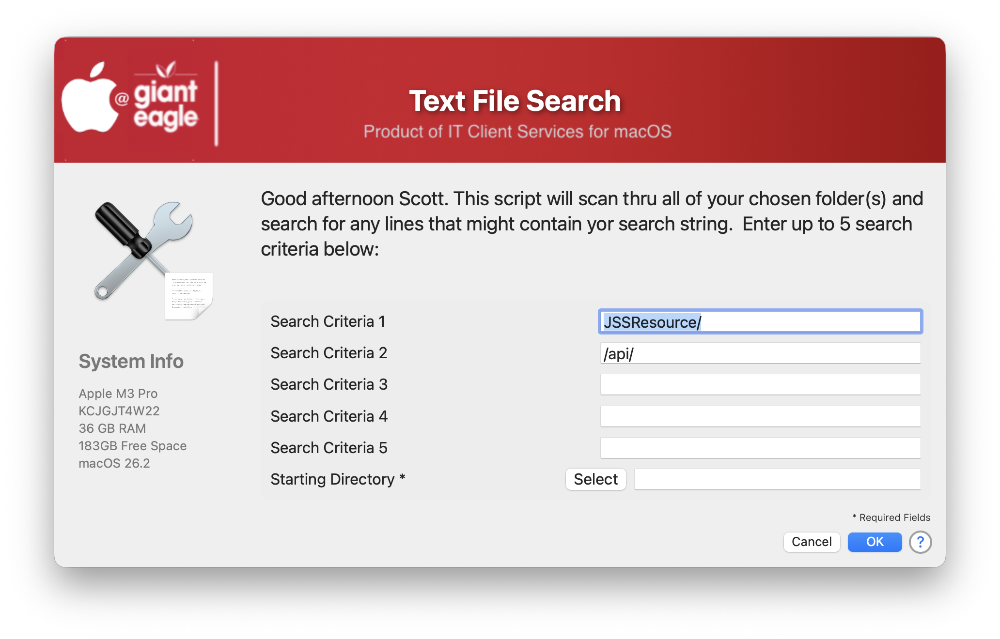

## Text File Search

I needed a handy way to search thru all of my source code and tell me what API calls that I am using, so I wrote this utility to help me scan for any string inside of files.  Your choose your starting directory and the script will scan all folders & subfolders from that point on looking for your search criteria.  By default, it will scan for the following files:

* Shell scripts (.bash, .sh, .zsh)
* Text Files (.txt)

You can add your own search criteria to search inside more files

You can also customize how many criteria you want to search for and load in some "default" search parameters (which can also be changed)

In this example, you can save your results as a .TXT or .CSV file, but you can easily add your own.

#### 1.0 - Initial Commit
