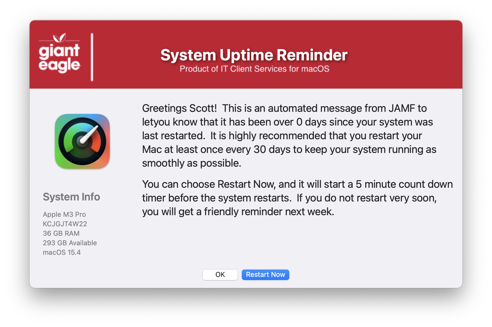
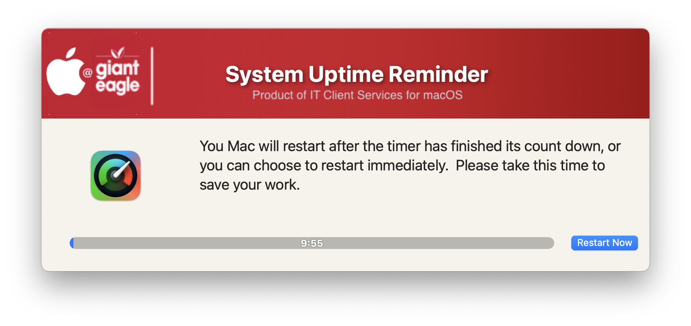
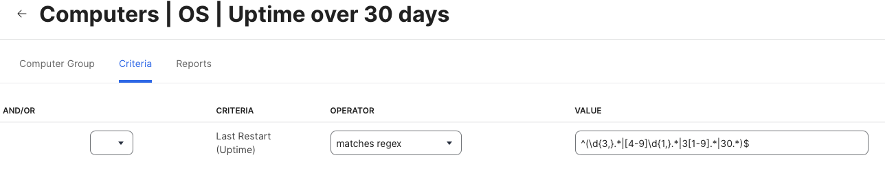

## Uptime

GUI Notification of a request for a user to restart if over X days have passed.  Both the days & timers can be adjust via script variables (or passed in from a JAMF script)





An example of the smartgroup that can be setup for systems with an uptime over 30 days



and the Extended Attribute that creates the 'Uptime Status' field of each computer

```
#!/bin/sh

uptimeOutput=$(uptime)

#detect "day" by removal and then string comparison, awk gets number of days between "up " and  " day"

[[ "${uptimeOutput/day/}" != "${uptimeOutput}" ]] && uptimeDays=$(awk -F "up | day" '{print $2}' <<< "${uptimeOutput}")

echo "<result>${uptimeDays:-0}</result>"
```
| **Version**|**Notes**|
|:--------:|-----|
| 1.0 | Initial Commit
| 1.1 | Added more logging details
| 1.2 | Added shutdown -r now command in case the applescript method fails
| 1.3 | Add logic to not display restart option if already on day 0
|| This addresses an issue in JAMF that this policy might be run before inventory gets accurate info
| 1.4 | Remove the MAC_HADWARE_CLASS item as it was misspelled and not used anymore...
| 1.5 | Add additional logging
||       set the default JAMF_LOGGED_IN_USER to current logged in user if not called from JAMF
||       Put in logic to install the icon if it doesn't already existing in specified location
||       Bumped min version of Swift Dialog to v2.5.0
| 1.6 | Code cleanup
||       Added feature to read in defaults file
||       removed unnecessary variables.
||       Fixed typos
