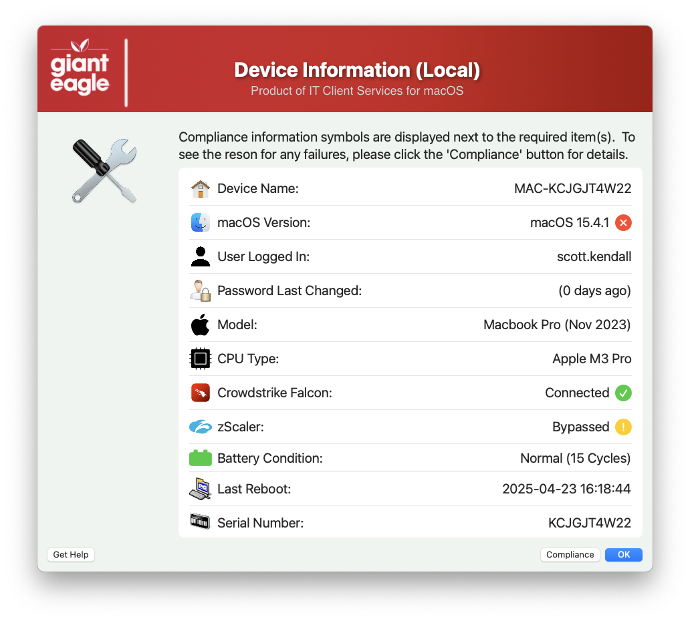
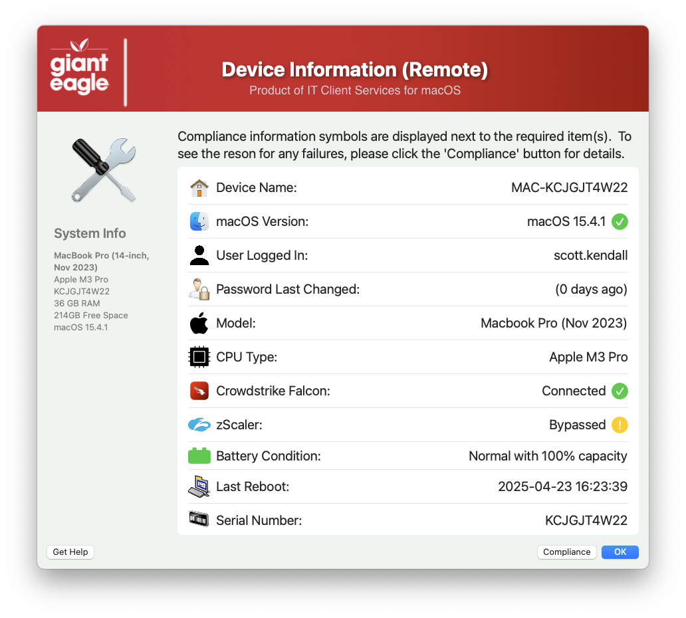
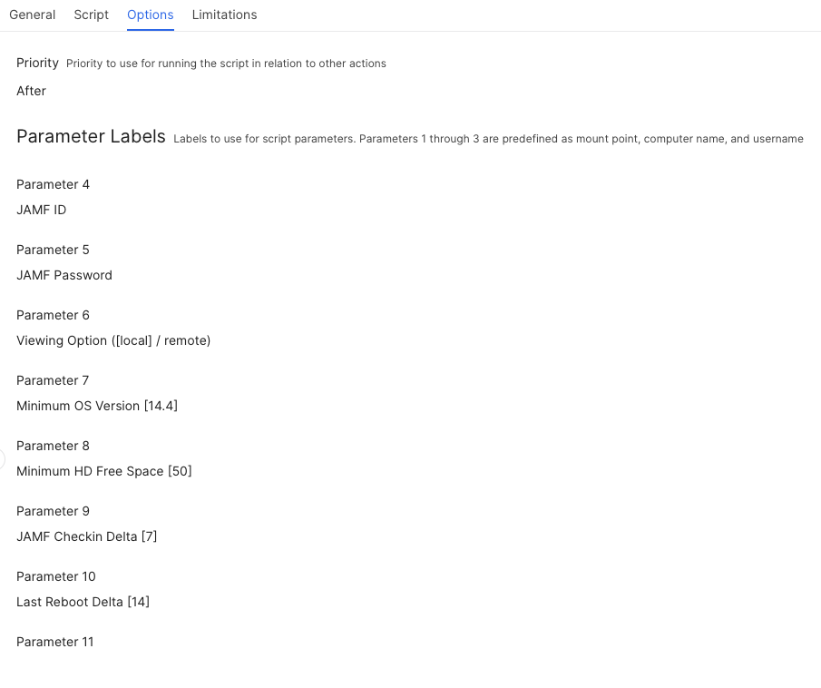

## View Inventory

I don't really want the Help Desk team to go into the JAMF server if it all possible, so I created this script so that the helpdesk team (or anyone) can view details about their system. You can either view the inventory of your local system or pull any JAMF registered device inventory.

**View Local Inventory**

**View Remote Inventory** (will be prompted for JAMF device/hostname)

Results of local JAMF record

Results of a compliance failure screen with details

**Parameters for System Script**

#### 1.0 - Initial code
#### 1.1 - Added addition logic for Mac mini...it isn't formatted the same as regular model names
#### 1.2 - Added feature for compliance reporting, removed unnecessary functions
#### 1.3 - Remove the MAC_HADWARE_CLASS item as it was misspelled and not used anymore...
#### 1.4 - Code cleanup
####       Added feature to read in defaults file
####       removed unnecessary variables.
####       Bumped min version of SD to 2.5.0
####       Fixed typos