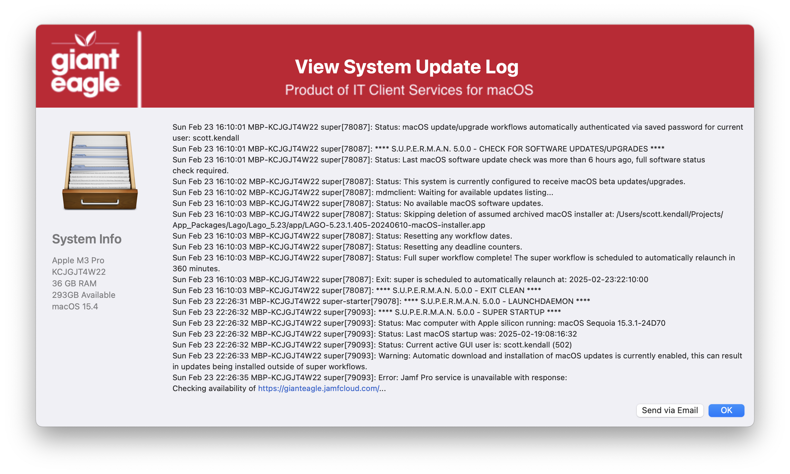
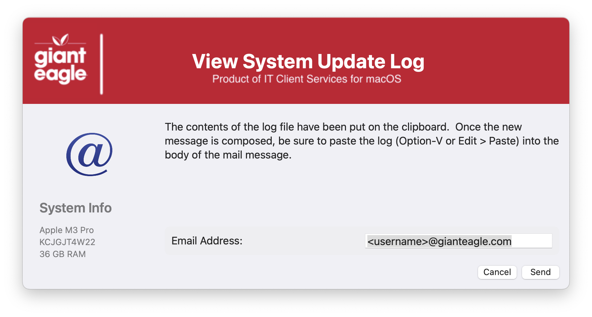
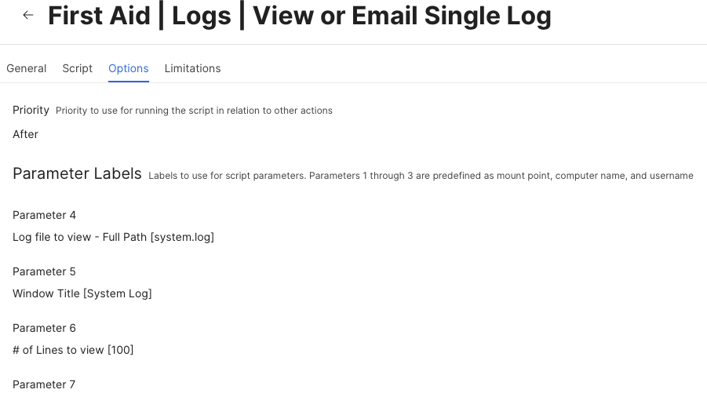
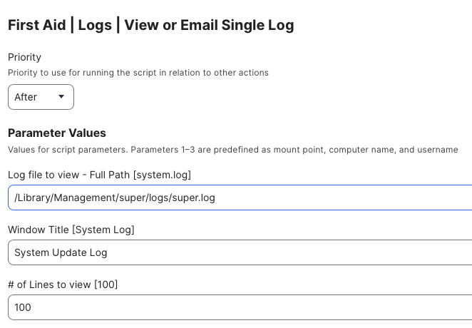

## View Logs

Handy GUI frontend for log viewing and/or emailing logs to someone

Script parameters for JAMF

Sample policy with customized parameters

#### 1.0 - Initial Commit
#### 1.1 - Remove the MAC_HADWARE_CLASS item as it was misspelled and not used anymore...
#### 1.2 - Made the variable EMAIL_APP to choose while mail app you want to use and automatically pasted the log contents into the body
#### 1.3 - Code cleanup
####       Added feature to read in defaults file
####       removed unnecessary variables.
####       Fixed typos
