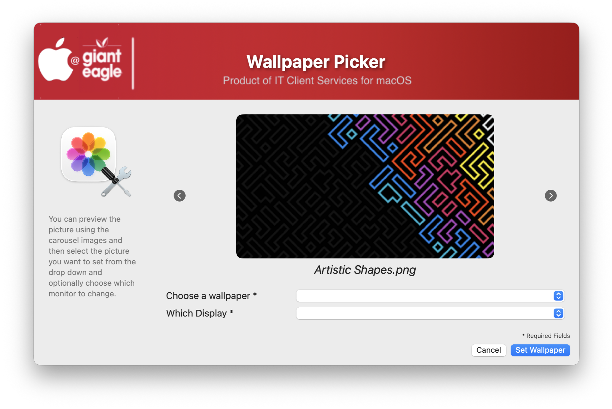

## Wallpaper Picker

This nifty little script will allow your users to pick from a selection of custom wallpaper using the carousel effect built into Swift Dialog.  The users can optionally choose which display the wallpaper can be set on.

This uses the free "Desktoppr" app found here: https://github.com/scriptingosx/desktoppr. So you will need to have this packaged up and made available from your MDM server.

The wallpapers can be either .PNG or .JPG (this can be changed in the script) and needs to be available in the location of your choosing.  If the Wallpaper directory doesn't exist, it will install it via a JAMF policy trigger during execution.

#### 1.0 - Initial 

