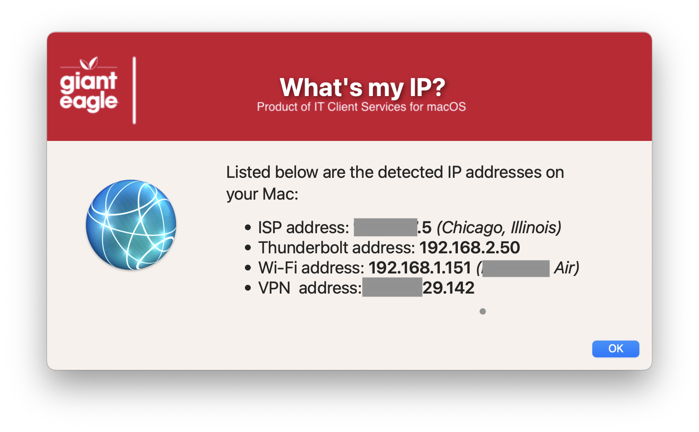

## WhatMyIP

Nice GUI to display all of the IPv4 address on a user's system (will find Cisco AnyConnet IP address if connected)

#### 1.0 - Initial rewrite using Swift Dialog prompts
#### 1.1 - Code cleanup to be more consistent with all apps
#### 1.2 - Reworked logic for all physical adapters to accommodate for older macs
#### 1.3 - Included logic to display Wifi name if found
#### 1.4 - Changed logic for Wi-Fi name to accommodate macOS 15.6 changes
####       Reworked top section for better idea of what can be modified
#### 1.5 - Code cleanup
####       Added feature to read in defaults file
####       removed unnecessary variables.
####       Fixed typos
